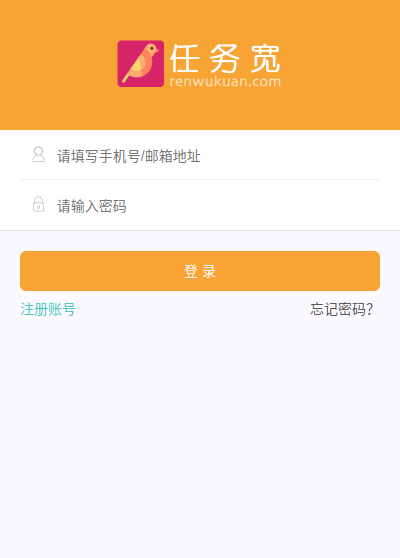
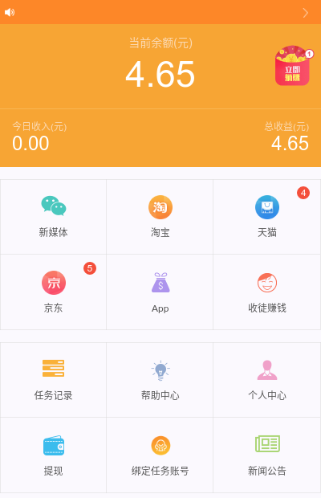
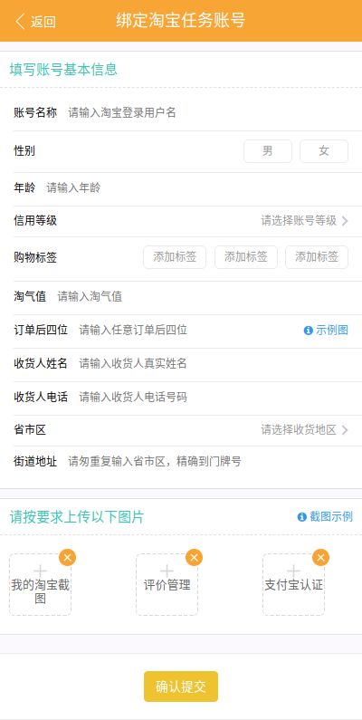
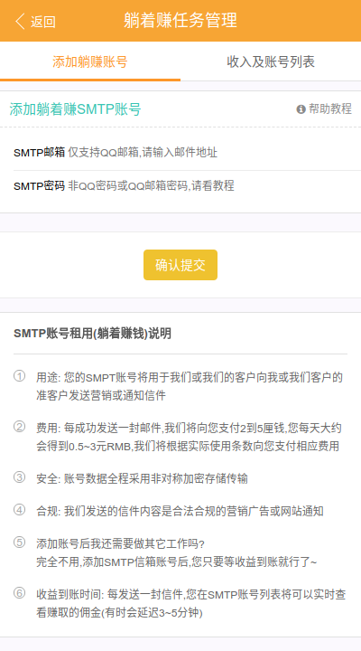
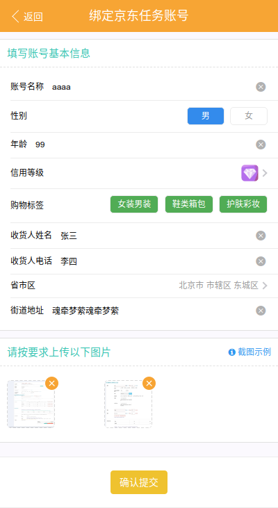

## Vue+vux+vuex+axios开发的兼职任务平台 web app
因为是从整个项目单独提出来的，API接口数据就没有了，自己看代码添加吧

    src/components      所有模块
    src/pages           所有页面
    src/router          路由文件
    src/utils/api.js    所有api接口
    src/vuex/store.js   状态管理

## 演示地址
http://hookover.github.io/vue-web-app

## 备注
    如果图片不显示，是连接地址的问题，看console log解决
    api返回的数据只能靠猜啦
    
## 安装
    npm install
    
## 编译
    npm run build
    
## 预览效果

